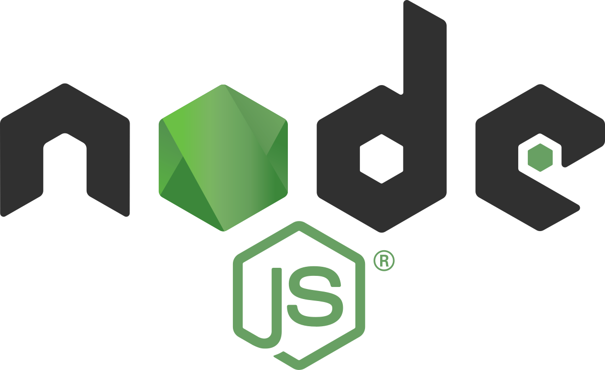
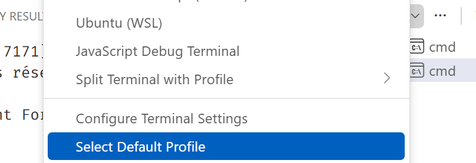
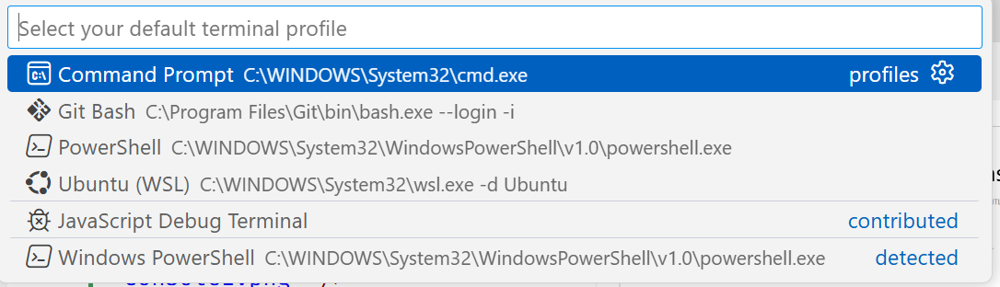

# Créer un serveur Node
<div align="center">

</div>

Sommaire :

[[_TOC_]]

## Télécharger Node
Pour pouvoir créer un projet node et utiliser le gestionnaire de package npm il faudra [télécharger NodeJs](https://nodejs.org/en) (prendre la version LTS)

## Créer un dossier
Nous allons devoir initialiser un dossier comme étant notre projet Node.

## Initialiser le projet
Pour initialiser notre projet comme étant un projet Node, il faudra taper dans la console.\
[Ctrl] + [J] dans VSC pour ouvrir la fenêtre console :
```cmd
npm init
```
Vous seront demandées les informations suivantes pour créer le projet :
> **package name** : nom du projet (par défaut nom du dossier)

> **version** : version du projet (par défaut 1.0.0)

> **description** : description rapide du projet (par défaut vide)

> **entry point** : définit le nom du fichier qui sera le point d'entrée du serveur (par défaut index.js) (je préfère app.js)

> **test command** : la commande pour lancer le testing (par défaut vide)

> **git repository** : mettre le lien du repository distant si on le connait déjà (par défaut vide)

> **keywords** : mot clefs relatifs à votre projet (par défaut vide)

> **author** : auteur du projet (par défaut vide)

> **license** : type de license du projet (par défaut ISC)

📃 Un fichier **package.json** est ensuite créé. C'est ce fichier qui définit tout le **setup** de votre projet. Dedans il y aura plus tard également toutes les **dépendances** du projet (toutes les librairies/modules dont le projet à besoin pour fonctionner)

<hr>

Nous devrons ensuite : 
* Créer le fichier **main** (si vous avez laissé index.js, vous devrez créer un fichier du même nom, si vous avez mis **app.js**, pareil)
* Rajouter une ligne dans les scripts (dans le package.json) pour pouvoir lancer notre projet.
    ```json
    "scripts": {
        /* autres commandes */
        "start" : "node app.js"
    }
    ```

<hr>

Pour initialiser git dans le projet et le mettre sur gitlab(github) : 

* Quand on fait un projet Node, il va être super important de ne **jamais** mettre certains fichiers/dossiers sur git. Nous avons donc besoin d'un fichier **gitignore**.
    > [!tip]
    > **Option 1** : Le faire à la main (mais vous devez penser à tous les fichiers à ignorer)

    > [!tip]
    > **Option 2** : Installer une **extension** qui permet de créer des fichiers .gitignore en fonction du projet qui s'appelle [gitignore - Code Zombie](https://marketplace.visualstudio.com/items?itemName=codezombiech.gitignore). Tapez soit [Ctrl] + [Maj] + [P] soit [F1] et un menu apparait en haut de VSC, tapez gitignore dedans et une option **Add gitignore** apparait. Vous recherchez **Node** et vous cliquez dessus. Votre fichier .gitignore est apparu.

* initialiser le projet comme étant un repository git local 
```cmd
git init
```

* ensuite faire comme d'habitude (lien vers repository distant, add, commit, push)

## Lancer le projet
Il faudra taper dans la console :
```cmd
npm start
```
qui ira exécuter la commande qui se trouve dans les scripts sur package.json qui s'appelle start.

## Installer les dépendances d'un projet
Pour créer le fichier node_modules avec toutes les dépendances du projet
```
npm install
```
ou
```
npm i
```

## Créer un serveur Node :
Dans notre app.js
```js
// 1) Création du serveur
// -> Import du module http
const http = require('http');

// -> Création du serveur
const server = http.createServer();

// 2) Écoute du serveur 
server.listen(8080, () => {
    console.log('Server started on Port 8080 !');
});
```

## Intercepter toutes les requêtes qui passent
Pour l'instant le serveur est créé mais nous n'interceptons les requêtes qui passent pour les traiter. Il va falloir le rajouter dans la création sur serveur.
Dans le app.js, dans la fonction createServer() on écrit :
```js
const server = http.createServer((req, res) => {
    //req est un objet contenant des infos sur la requête qui arrive dans notre serveur
    //res est un objet qui représente la réponse que va renvoyer notre serveur
    console.log(req.url); /* affiche l'url de la requête qui vient d'arriver*/
    console.log(req.method); /* affiche la méthode de la requête qui vient d'arriver*/
});
```

<hr>

# Annexes
## Configurer cmd comme console par défaut
Sur VSC, cliquez sur le V dans la console :


Choisissez Setup Default Profile :


Choisissez Command Prompt comme console par défaut :
