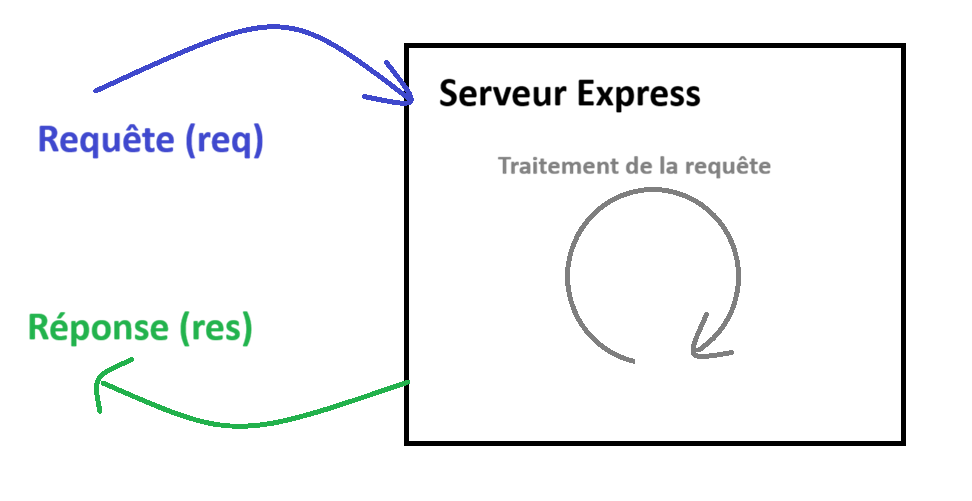
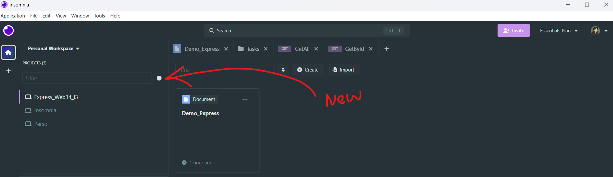
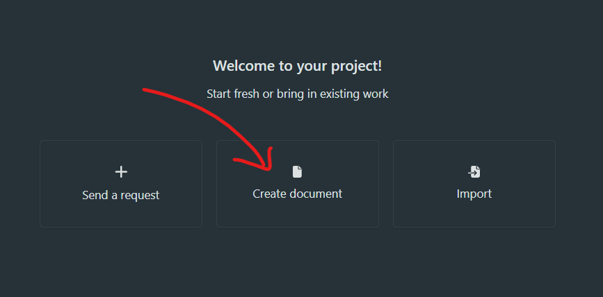
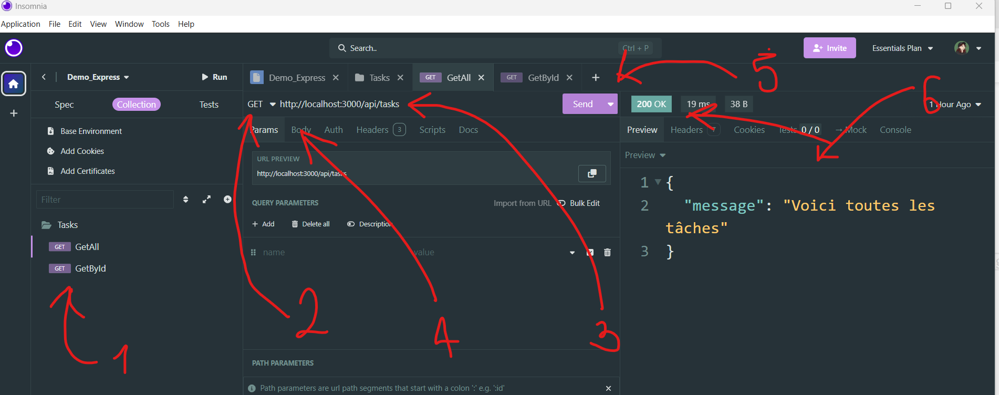
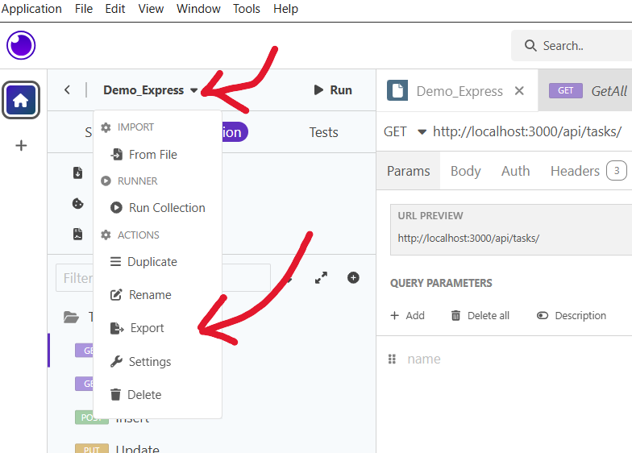
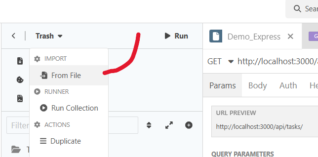

<p style="color:#33B265; font-weight:bold">Sommaire :</p>

[[_TOC_]]

# Web API avec Express
<hr>

Une API est un serveur Web qui va recevoir une **requête**, la traiter, potentiellement se "connecter" à des données et renvoyer une **réponse** qui possèdera un statut (HttpCode) et potentiellement des données renvoyées (json ou XML).

<div align="center">

</div>

## Les API
<hr>

### Fonctionnement d'une API
#### Les requêtes

Les requêtes sont envoyées via HTTP et possèdent plusieurs informations qui vont permettre au serveur de comprendre la demande.

* **Verbe** (Verb) : Méthode de la requête. Indique l'action qu'on veut réaliser.
    * <span style="color:#33B265">**GET**</span> : Récupérer quelque chose
    * <span style="color:#33B265">**POST**</span> : Envoyer quelque chose
    * <span style="color:#33B265">**PUT**</span> : Modification totale de quelque chose
    * <span style="color:#33B265">**PATCH**</span> : Modification partielle de quelque chose
    * <span style="color:#33B265">**DELETE**</span> : Suppression de quelque chose

* **Url** : Sur quoi et comment on veut faire notre requête. Elle peut contenir plusieurs éléments
    * Une partie **statique** - Le QUOI : \
    ex : http://localhost:3000/api/produits 
    * Des **paramètres** (partie dynamique) - Le QUOI plus précis _(optionnel)_ :\
    ex : http://localhost:3000/api/produits/42
    * Une **query** - Le COMMENT _(optionnel)_ : \
    Permet de mettre en place des filtres\
    ex : http://localhost:3000/api/produits?category=bricolage&lowPrice=0&highPrice=15

* **Body** (Corps de la requête) _(optionnel)_ : Représente ce qu'on doit envoyer avec la requête (json, formData, XML)

* **Headers** (En tête de la requête) : On en reparlera plus tard mais pour faire court, il s'agit d'informations à propos de la requête

<br>

> [!Note]
> Certaines choses seront utilisées avec certains verbes particuliers
>
> → GET http://localhost:3000/api/produits \
> Verb + url statique\
> Récupérer tous les produits
>
> → GET http://localhost:3000/api/produits/42 \
> Verb + url statique + params\
> Récupérer le produit dont l'id est 42
> 
> → GET http://localhost:3000/api/produits?offset=10&limit=30 \
> Verb + url statique + query\
> Récupérer les produits en partant du 10ème et en sélectionnant les 30 prochains (query de pagination)
>
> → POST http://localhost:3000/api/produits \
> → body : { "name" : "Patat", "price" : 4.23 }\
> Verb + url statique + body\
> Ajouter un nouveau produit avec les infos présentent dans le body
>
> → PUT/PATCH http://localhost:3000/api/produits/42 \
> → body : { "name" : "Patate", "price" : 4.23 }\
> Verb + url statique + params + body\
> Modifier globalement ou partiellement le produit dont l'id est 42
>
> → DELETE http://localhost:3000/api/produits/42 \
> Verb + url statique + params\
> Supprimer le produit dont l'id est 42

#### Les réponses

L'API va toujours renvoyer une réponse qui sera composée de :
* un **Statut** (statusCode, HTTPCode) : un code qui permet de savoir comment s'est passé la requête
    * 2XX : les codes de succès 
    * 3XX : indiquer une redirection
    * 4XX : indiquer qu'une erreur connue de l'API est survenue
    * 5XX : indiquer une erreur de serveur (serveur ne répond pas, db cassée)
* des **données** _(optionnel)_ : Certaines requêtes, notamment les GET vont nous renvoyer du json (ou XML, fichiers...)

### Principes d'API REST
<hr>

Une API REST(Ful) REpresentational State Transfert doit respecter les principes suivants :

* **Stateless** (Sans état) : L'API ne sauvegarde aucune donnée/état utilisateur. Si besoin d'identifier qui fait la requête, cette informatione devra être transmise dans la requête (query, headers, cookies)

* **Interface Uniforme** : L'API doit utiliser des modèles de données uniformes et cohérents en entrée et en sortie et utiliser les bons Verb.

* **Ressources** : Les données sont vues comme des ressources et les url doivent être parlantes.

* **Couche & Cache** : L'API devrait idéalement être séparée en plusieurs couches logiques (architecture). Les requêtes devraient idéalement être mises en cache.

## Initialiser un projet Node
<hr>

### Télécharger Node
[Télécharger la dernière version LTS de Node](https://nodejs.org/fr) (dernière version stable) pour avoir accès à Node et son gestionnaire de package npm.

### Initialiser un dossier comme étant un projet Node
```
npm init
```
Tout un tas de questions vous sont posées pour configurer le projet. Si appuyez sur Enter c'est la valeur par défaut renseignée entre () qui sera prise. Le seul truc que je modifie c'est le fichier de point d'entrée (entry point) que je renomme app.js.

> Un fichier **package.json** est alors créé, il contient les commandes pour lancer le projet, les tests... dans un objet appelé **scripts** mais aussi, les dépendances du projet qui se trouveront dans un objet appelé **dependencies**. (Les dépendances sont une liste de librairies js dont notre projet a besoin pour fonctionner)

> [!WARNING]
> ⚠️ Il faudra penser à avoir un gitignore en règle. Vous pouvez le faire à la main mais attention à ne rien oublier ou [télécharger une extension VSC](https://marketplace.visualstudio.com/items?itemName=codezombiech.gitignore) qui permet de créer un fichier .gitignore en rapport avec un type de projet. Grâce à cette extension vous pourrez :
> * Appuyez sur F1 ou CTRL + MAJ + P pour ouvrir la barre des tâches
> * Dans la barre de recherche commencez à taper gitignore
> * Selectionnez Add gitignore
> * Une nouvelle barre de recherche apparait, commencez à taper Node
> * Selectionnez Node dans la liste
>
> 🎊 Tada ! Vous avez votre .gitignore

### Créer le fichier app.js

Créer un fichier à la racine du projet appelé app.js (index.js si vous avez laissé la valeur par défaut)\

Rajouter un script pour lancer le fichier app.js :
```json
 "scripts": {
    "start" : "node app.js",
  }
```

## Express

[Express](https://expressjs.com/) est une librairie JS qui permet de créer des web app et des API plus rapidement et facilement qu'en NodeJs pur.

Pour l'installer dans le projet, tapez dans la console :
```
npm i express
```
ou
```
npm install express
```

Express est maintenant installé dans le projet et vous pouvez voir une dépendance qui s'est rajoutée dans le fichier package.json

### Bonus : Récupérer un projet Node/Express sur Git

Quand vous allez récupérer un projet Node (Express, React, Angular, etc...), il faudra refaire un node_modules avec toutes les dépendances du projet.
Pour cela, rien de plus simple :
```
npm i
```

Aussi, vous n'aurez pas le fichier _.env_ puisqu'il n'est pas présent sur git. Il faudra donc le recréer de votre côté en suivant le _.env.example_.

### Création d'un serveur Web avec Express
Nous allons utiliser la librairie Express pour créer notre serveur. Pour se faire, dans le fichier app.js, écrire :

```js
const express = require('express'); //import d'express
const server = express(); //création du serveur express

// get sur localhost:3000
server.get('/', (req, res) => {

    res.send({ message : 'C\'est good'}, 200);
})

// get sur localhost:3000/products
server.get('/products', (req, res) => {

    res.send({ message : 'Voici tous les produits'}, 200);
})


// Écouter le serveur sur un port spécifique
server.listen(3000, () => {
    console.log(`🚀 Express Server started on port ${ 3000 }`);
})
```

### Restart automatique du serveur en cas de modification

Le point un peu chiant avec notre serveur actuel c'est qu'à chaque modification du code, on doit couper notre serveur et le relancer avec npm start. Ce serait super cool que le serveur se relance tout seul, à chaque fois qu'on sauvegarde.

#### Méthode 1 : Nodemon
[Nodemon](https://www.npmjs.com/package/nodemon) est une librairie js qui nous permet de refresh et redémarrer le serveur à chaque sauvegarde.
Pour l'installer :
```
npm i -D nodemon
```
-D est présent pour l'installer dans les dépendances de dev uniquement

Il faudra ensuite rajouter dans le fichier package.json un nouveau script :
```json
"scripts": {
    "start": "node app.js",
    "dev" : "nodemon app.js"
}
```

#### Méthode 2 : Watch natif de Node depuis la version 18+

Il suffit juste de rajouter un nouveau script dans le package.json :

```json
"scripts": {
    "start": "node app.js",
    "dev" : "node --watch app.js"
}
```
Pour lancer en mode dev, il faudra taper : 
```
npm run dev
```

### Les variables d'environnement
Ce sont des variables stockées sur votre machine. On y stocke des infos de connection ou propres à la machine etc.

Elles sont accessible en js dans un object process via sa propriété process.env
```js
console.log(process.env);
```

Pour créer des nouvelles variables d'environnement, on va créer un fichier **.env** dans lequel on va mettre nos variables d'environnement. Ces infos étant très souvent confidentielles, ce type de fichier est ignoré par notre gitignore.\
Comme il ne sera jamais mis sur Git, pour que les autres personnes sachent quelles variables ils doivent mettre en place chez eux et avec quel nom, on fait souvent un fichier **.env.example**.\
exemple d'un fichier _.env_ :
```
PORT=3000
DB_HOST=http://serveurDeSoup
DB_USER=Soup
DB_PASSWORD=Miaou1234?
```

Pour mettre les variables d'environnement présentes dans notre fichier .env dans les variables de la machine, deux solutions :
* Via la librairie [dotenv](https://www.npmjs.com/package/dotenv)
* Via une "nouvelle" fonctionnalité native de Node donc directement dans notre script dans le package.json :
    ```json
     "scripts": {
        "start": "node --env-file=.env app.js",
        "dev" : "node --watch --env-file=.env app.js",
        
  }
    ```

### Architecture de base du projet

<div align="center"> 

</div> 

Les requêtes arrivent dans l'application (_app.js_) et sont dispatchées vers les fichiers de routes (_dossier routes_). En fonction de l'url, du verbe et des potentiels paramètres de routes, on déclenchera la bonne fonction du controller de la ressource  (_dossier controllers_). Ces controllers se chargent de la logique API, ils vont appeler des services (_dossier services_) qui eux se chargent d'intéragir avec les données. Le controlleur va ensuite, en fonction du résultat obtenu, répondre avec le bon code à la requête.

\> demo_express\
|- 📁 controllers\
|- 📁 middlewares\
|- 📁 routes\
|- 📁 services\
|- app.js\
|- .env\
|- package.json

> 1) 📁 routes : définition de toutes les routes de notre API (verb + url statique + params)

> 2) 📁 controllers : définition de ce que renvoie l'api

> 3) 📁 services : logique d'accès aux données

> 4) 📁 middlewares : un middleware est une fonction qui va intercepter la requête (ou une erreur) afin d'y ajouter/consulter des informations et choisir de continuer la requête ou de l'arrêter. (Il en existe 3 types : router-lvl, app-lvl, error-handler)

### Définition des routes
#### Point d'entrée
On va commencer par créer le point d'entrée de toutes nos routes en créant un fichier **index.js** dans le dossier **routes**.

Dans ce fichier index.js :
```js
const router = require('express').Router();

router.get('/', (req, res) => {
    res.send("Bienvenue sur notre API de gestion de tâches", 200)
});

module.exports = router;
```

Dans le fichier app.js, on va indiquer que notre serveur Express doit utiliser ce routeur (après création server et avant listen) :
```js
const router = require("./routes");
server.use('/api', router);
```

#### Ajouter d'autres routes

Pour bien architecturer notre application, on va essayer de gérer les routes de chaque ressource individuellement. Pour cela, on va créer un routeur pour chaque type de ressources et faire le lien entre notre routeur d'entrée (index.js) et nos sous-routeurs.

Pour créer un sous-routeur, on crée un fichier nomRessource.router.js.\
exemple avec _task.router.js_ :
```js
const taskRouter = require('express').Router(); //création du sous-routeur task

// en get sur localhost:3000/api/tasks/
taskRouter.get('/', (req, res) => {
    res.send('Voici toutes les tâches', 200)
})

// :id segment dynamique
// en get sur localhost:3000/api/tasks/XX
taskRouter.get('/:id', (req, res) => {
    const id = req.params.id;
    res.send(`Voici la tâche numero ${id}`)
})

// en post sur localhost:3000/api/tasks/
taskRouter.post('/', (req, res) => {
    res.send('Tâche ajoutée avec succès', 200)
})

//export de notre routeur pour pouvoir l'importer depuis un autre fichier
module.exports = taskRouter;
```

Pour donner accès à ce sous-routeur depuis notre fichier principal _index.js_ :
```js
// import du task routeur 
const taskRouter = require('./task.router');

// permet d'indiquer que notre router de base doit utiliser, si l'url est localhost:3000/api/tasks, le task routeur pour la suite
router.use('/tasks', taskRouter)
```

> [!TIP]
> À ce stade, nous ne pouvons tester que nos routes en GET puisque le navigateur ne nous permet que de faire du GET. Pour pouvoir tester tous les verbes, nous aurons besoin de [logiciels de test d'API](#logiciels-test-api).

#### Autre façon d'écrire les routes

Une autre façon de ranger les routes, quand on a plusieurs fois la même url mais avec différents verbes c'est de partir de l'url et indiquer toutes les méthodes possibles sur cette url.

```js
taskRouter.route('/')
    .get((req, res) => { })
    .post((req, res) => { })

taskRouter.route('/:id')
    .get((req, res) => { })
    .put((req, res) => { })
    .patch((req, res) => { })
    .delete((req, res) => { })
```

### Les controlleurs
Les controllers sont les endroits où on va gérer la requête (ce qui rentre req et ce qui sort res). En général, on fait un controller par type de ressource.

On va donc créer un fichier nomRessource.controller.js.

Un controller est un objet qui contiendra des fonctions.

_ex : task.controller.js :_
```js
//création de notre controller
const taskController = {
}

//on le rend importable en l'exportant
module.exports = taskController;
```

Chaque fonction représentera une action qu'on peut faire sur la ressource.
```js
const taskController = {

    getAll : (req, res) => {},

    getById : (req, res) => {},

    getByUser : (req, res) => {},

    insert : (req, res) => {},

    update : (req, res) => {},

    updateStatus : (req, res) => {},

    delete : (req, res) => {}

}
```

Il ne nous reste plus qu'à relier la route avec sa fonctionnalité.

_ex : task.router.js :_
```js
// importer le controleur qu'on vient de créer
const taskController = require('../controllers/task.controller');

// On relie ensuite chaque route à sa fonctionnalité
taskRouter.route('/')
    .get(taskController.getAll)
    .post(taskController.insert)

taskRouter.route('/:id')
    .get(taskController.getById)
    .put(taskController.update)
    .delete(taskController.delete)
    .patch(taskController.updateStatus)

taskRouter.get('/user/:name', taskController.getByUser)
```

Pour ne pas que notre requête soit infinie alors que nous n'avons pas encore de code dans notre controller, nous pouvons mettre fin à la requête en envoyant un code **501** - _Not Implemented_ - qui signifie que la route existe bien mais que le code derrière n'a pas été implémenté (développé) par les dev.

```js
const taskController = {
    getAll : (req, res) => {
        res.sendStatus(501);
    }
}
```

> [!NOTE]
> Les DTOs - Data Transfert Object
> Ce sont des réprésentations des objets telles qu'elles entrent et sortent de l'API. Parfois à l'insertion, l'objet n'est pas identique à celui en db donc on aura besoin d'un DTO d'entrée. Parfois, les objets renvoyés par l'API auront besoin d'avoir des données supprimées ou ajoutées, on fera donc un DTO pour ça.

### Les services
- [ ] Les services 
- [ ] Faire un lien vers la partie DB du Readme

### Les middlewares
- [ ] Les middlewares
- [ ] Faire un lien vers la partie Multer
- [ ] Faire un lien vers la partie Auth

<hr>

## Logiciels test API

### Présentation
Pour pouvoir tester toutes nos routes d'API, nous avons plusieurs outils à dispositon :
* [Postman](https://www.postman.com/)
* [Insomnia](https://insomnia.rest/)
* [Thunder Client](https://marketplace.visualstudio.com/items?itemName=rangav.vscode-thunder-client) - Extension VSC

### Créer un nouveau document de test avec Insomnia
Mon préféré étant Insomnia, c'est avec celui ci que je ferai la démo.

Sur la page d'accueil, cliquez ici pour ajouter un nouveau projet :
<div align="center">

</div>

Une fois le projet créé, sur la partie droite, créez un nouveau document :
<div align="center">

</div>

Dans le document, nous allons créer nos requêtes à tester : 
<div align="center">

</div>

* 1 - Liste des requêtes à tester. Idéalement, chaque requête sera dans une dossier représentant la ressource sur laquelle on teste.
* 2 - L'endroit pour changer la méthode et tester en GET, POST, PUT, PATCH, DELETE.
* 3 - L'endroit pour setup l'url de la requête avec les éventuels paramètres
* 4 - L'endroit pour configurer le body (ce qu'on veut envoyer lors d'un POST, PATCH ou PUT par ex)
* 5 - Le bouton pour envoyer la requête
* 6 - L'affichage de la réponse (code en haut et texte, json etc en dessous)

### Exporter et Importer un document

**Exporter** : 
<div align="center">

</div>

Choisissez ensuite les requêtes à exporter puis choisssez Insomnia comme type de document puis validez.

**Importer** :
<div align="center">

</div>

Sélectionnez votre fichier insomnia (ou postman), appuyez sur Scan et tada, votre collection se remplit.

\> [Revenir à la suite du cours Express - Les controlleurs](#les-controlleurs)